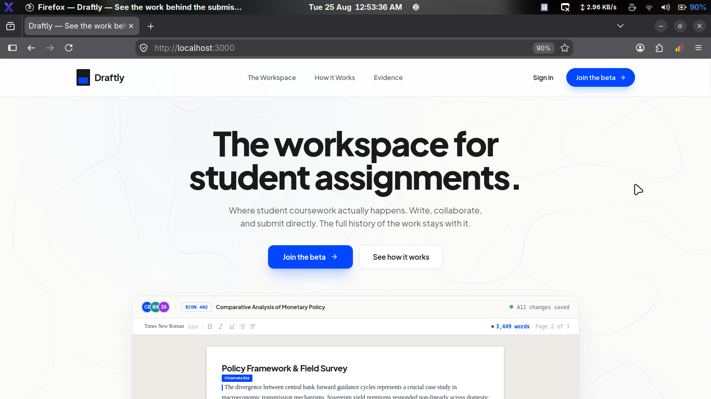
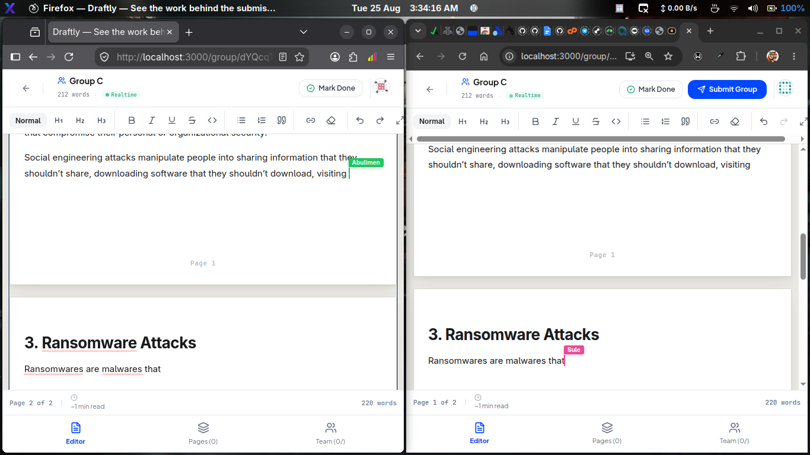
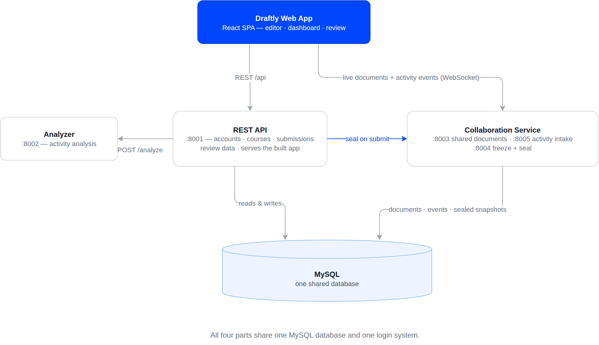
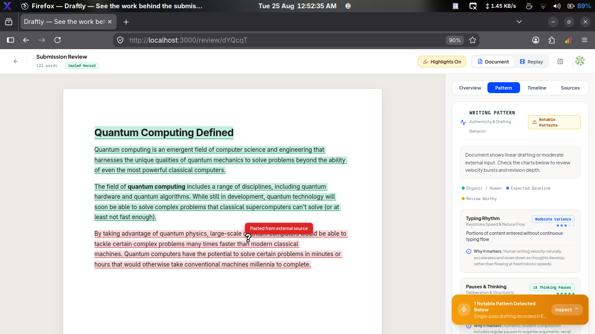
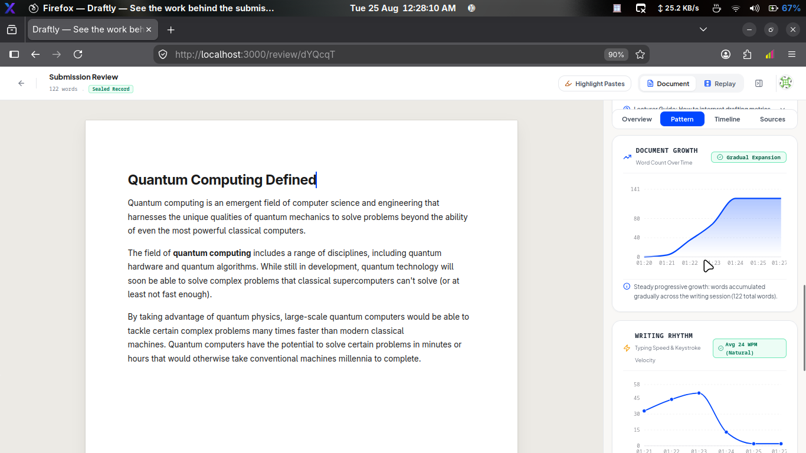

# Draftly

**The workspace for student assignments.**

Draftly is a web-based educational workspace where students write, organize, collaborate on, and submit assignments in one place. Instead of treating an assignment as a static file uploaded at the deadline, Draftly preserves the writing process and its development history alongside the final submission.

Students can work individually or collaborate in real time on shared group documents. Lecturers can review submitted work, inspect individual group member contributions measured by surviving text, and access process analytics when evaluating how an assignment developed.



## 60-Second Overview: Why Draftly Exists

Higher education faces two major challenges in modern student coursework:

1. Free-Riding in Group Assignments: In traditional group assignments, several names appear on a single uploaded document, but educators have no reliable way to verify whether all students contributed fairly.
2. The AI Detection Arms Race: Generative AI tools have made traditional text-based AI detectors unreliable. Detectors produce black-box percentage scores that fail to explain how a document was created, creating false accusations and friction between students and faculty.

Draftly approaches these problems through process-first architecture:

* For Group Work: Every group member writes in a shared, real-time collaborative document powered by Yjs CRDTs. When the assignment is submitted, the server freezes the document and computes individual contributions based on the surviving text that remains in the final submission.
* For Writing Process Integrity: As students write in the Microsoft Word-styled rich text editor, Draftly records process telemetry (typing speed, pause distributions, editing cadence, and pasted text blocks). This telemetry provides educators with rich contextual evidence of how work evolved over time, rather than relying on a black-box AI score.



## Architecture Overview

Draftly is built as an independent multi-service architecture sharing a single MySQL database and unified JWT authentication:



* Frontend (Vite, React 18, Tailwind CSS, TipTap 2.6): Word-styled rich text writing environment with live cursor presence, section reordering, and analytics visualization.
* API Service (Node HTTP, Port 8001): Handles authentication, courses, assignments, group management, submission lifecycle, review aggregation, and static hosting of the production SPA.
* Collaboration Service (Hocuspocus and Node WebSocket, Ports 8003, 8004, 8005): Manages Yjs CRDT document synchronization (Port 8003), loopback internal state and sealing HTTP API (Port 8004), and realtime event tracking intake (Port 8005).
* Analyzer Service (Node HTTP, Port 8002): Stateless originality verdict engine calculating continuous mathematical curves across 5 weighted factors with zero veto caps.
* Database (MySQL 8, InnoDB, utf8mb4): Shared relational store with prepared queries and strict foreign key integrity.

## Core Documentation

* [Architecture Decisions (DECISIONS.md)](DECISIONS.md): In-depth rationale for 7 key engineering decisions, alternatives considered, trade-offs, and limitations.
* [Known Limitations (KNOWN_LIMITATIONS.md)](KNOWN_LIMITATIONS.md): Transparent technical boundaries regarding scaling, offline support, and attribution scope.
* [Security Policy (SECURITY.md)](SECURITY.md): Trust model, internal service authorization, and dependency security audit findings.
* [Technical Interview Guide (INTERVIEW_GUIDE.md)](INTERVIEW_GUIDE.md): Codebase defense guide with architectural deep-dive questions and a 12-location code defense map.

## Writing Process Telemetry and Scientific Honesty

Draftly deliberately distinguishes between process evidence and automated claims:

* Context, Not Automated Verdicts: Process telemetry (typing cadence, pause intervals, document growth, and paste history) gives lecturers observable evidence of how work developed. It does NOT claim to prove human authorship or prove that generative AI was not used.
* Explainable Scoring: The analyzer engine uses continuous curves without arbitrary veto caps. Pasting text lowers the paste factor score proportionally based on paste volume, but does not trigger an automatic failure.
* Human Decision-Making: The final evaluation remains in the hands of the educator.





## Quick Start and Local Setup

### Prerequisites

* Node.js 18 or higher
* MySQL 8
* npm 9 or higher

### 1. Clone and Install Dependencies

```bash
git clone https://github.com/abulimen/assignment-management.git
cd assignment-management

# Clean installation across all services
npm ci
npm ci --prefix api
npm ci --prefix collab
npm ci --prefix analyzer-node
npm ci --prefix shared/core
```

### 2. Configure Environment

Copy the example environment configuration:

```bash
cp .env.example .env
```

Ensure your MySQL server is running. For local development on loopback (127.0.0.1), default settings will connect to MySQL root with no password. If your MySQL setup uses a password, set `DB_PASS=your_password` in `.env`.

### 3. Initialize the Database

Create the development database:

```bash
mysql -h 127.0.0.1 -u root -e "CREATE DATABASE IF NOT EXISTS assignment_mgmt CHARACTER SET utf8mb4 COLLATE utf8mb4_unicode_ci;"

# Apply schema and migrations
mysql -h 127.0.0.1 -u root assignment_mgmt < database/schema.sql
for migration in database/migration_*.sql; do
  mysql -h 127.0.0.1 -u root assignment_mgmt < "$migration"
done
```

### 4. Start All Services

Launch all four services (API `:8001`, Analyzer `:8002`, Collab `:8003/:8004/:8005`, Vite `:3000`) with a single command:

```bash
./start.sh
```

Open your browser at `http://localhost:3000`.

## Automated Test Suites

Draftly includes comprehensive test suites across all layers (370+ total automated tests):

```bash
# Run the entire test suite across all services
npm run test:all

# Run individual test suites
npm run test:frontend    # React unit and component tests (130 tests)
npm run test:collab      # Collab server, Yjs sync, and sealing tests (50 tests)
npm run test:api         # REST API contract and authorization tests (153 tests)
npm run test:analyzer    # Originality scoring fairness and engine tests (45 tests)
```

Integration tests automatically bootstrap and migrate the test database (`assignment_mgmt_test`) if it does not already exist.

## 90-Second Interactive Demonstration

To experience Draftly's flagship collaborative features in under two minutes:

1. Open Two Browser Windows:
   * Window A (Incognito): Navigate to `http://localhost:3000/register` and register as a Student named Alice.
   * Window B: Navigate to `http://localhost:3000/register` and register as a Student named Bob.
2. Join a Group Assignment:
   * Alice creates or opens a group assignment workspace and copies the Group Invite Code.
   * Bob clicks Join Group and enters the invite code.
3. Simultaneous Real-Time Editing:
   * Both Alice and Bob type in the document at the same time.
   * Observe live remote cursors, real-time character synchronization, and instant section updates.
4. Member Completion Vector:
   * Alice clicks Mark Section Done. Her status in the group roster changes to Done with an immutable document snapshot hash.
5. Group Leader Submission and Sealing:
   * When all members are marked Done, the group leader submits the assignment.
   * The server executes a two-phase seal: freezing the document, computing surviving character counts per author, generating a SHA-256 checksum, and downgrading all live client connections to read-only mode.
6. Lecturer Review:
   * Log in as a Lecturer and navigate to the assignment submission review page.
   * Inspect the Contribution X-Ray breakdown, paste analysis, document growth chart, and typing cadence timeline.

## Technology Stack

| Layer | Technology | Purpose |
| :--- | :--- | :--- |
| Frontend | React 18, Vite, Tailwind CSS | High-performance single page application |
| Editor | TipTap 2.6, ProseMirror | Word-styled rich text editor with custom extensions |
| Realtime | Yjs CRDTs, Hocuspocus | Real-time collaborative document synchronization |
| Backend API | Node.js (node:http) | High-throughput REST API and static asset hosting |
| Collaboration | Node.js, ws | Dedicated WebSocket room and tracking server |
| Analyzer | Node.js | Stateless continuous originality scoring engine |
| Database | MySQL 8 (InnoDB, utf8mb4) | Relational store with parameterized prepared queries |
| Security | JWT (HS256), bcrypt | Role-based and row-level access control |
| Testing | Vitest | Automated contract, fairness, and integration testing |

## License and Author

Built by **Samuel Jonathan** ([@abulimen](https://github.com/abulimen)).

This repository is publicly available for portfolio and evaluation purposes. See [LICENSE](LICENSE) for terms.
