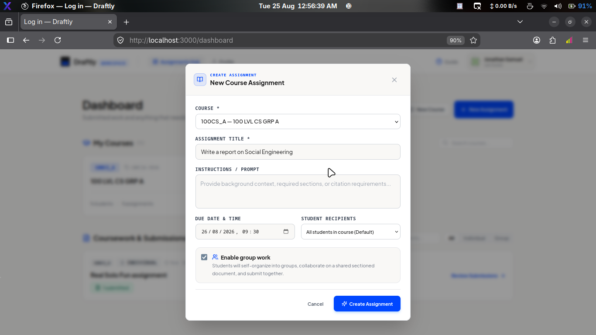
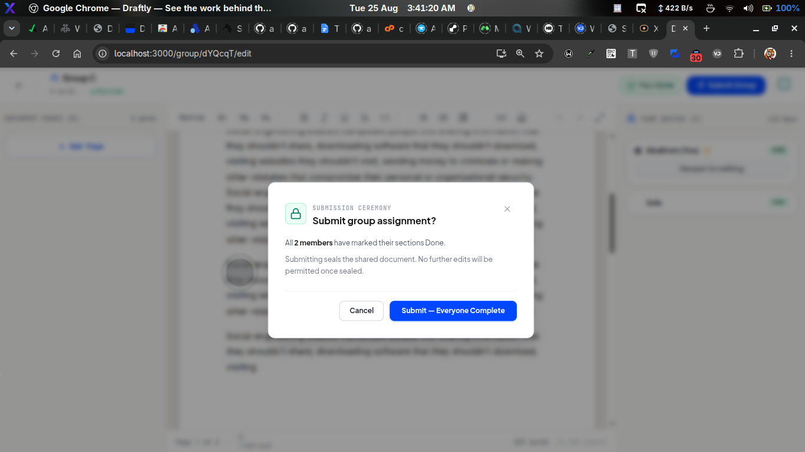
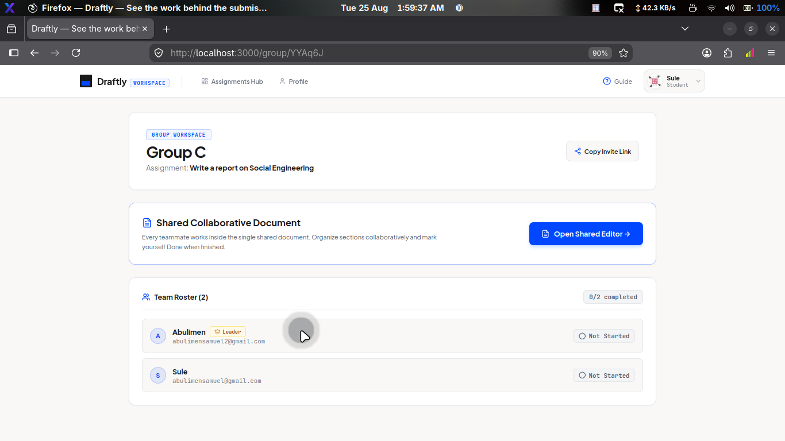
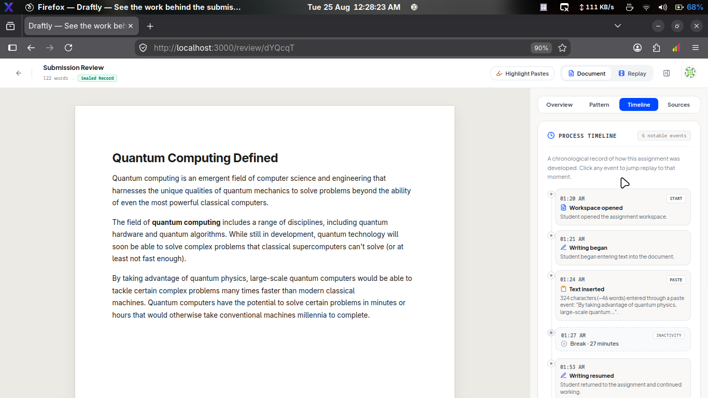

# Draftly

**The workspace for student assignments.**

Draftly is a web-based workspace where students can write, organize, collaborate on, and submit assignments in one place.

Instead of the assignment ending when a student uploads a file, Draftly keeps the work and its development history together.

Students can work individually or with a group, while lecturers can review the finished work and access its history when they need more context.


---

## What Draftly does

Draftly brings the assignment process into one workspace.

A student can:

* Write directly in a Word-style editor.
* Organize longer assignments into sections.
* Work alone or collaborate with a group in real time.
* See who is currently working on the document.
* Continue working without manually saving different versions.
* Submit the finished assignment as a fixed record of the work.

For group assignments, each member's contribution is tracked throughout the document. The system can later show how much of the final document came from each member.

Lecturers can review the submitted work normally, while having access to the development history when they need it.


*Two students writing in the same group document at the same time — each sees the other's cursor live.*

---

## Why I built it

Generative AI has changed the way students write assignments.

Today, a lecturer can receive a piece of work and run it through an AI detector, only to get a score saying that the work is probably AI-generated. But a score doesn't explain how the assignment was actually written. At the same time, students can use tools designed to avoid these detectors, while detector companies continue trying to catch up with these tools. It ends up becoming a constant race, and neither side gets a clear answer.

So I started thinking about a different approach. **Instead of trying to guess how an assignment was written from the final document, why not keep track of the work as it happens?**

That would give both students and lecturers something much more useful than a single AI-generated score. A student could show how their work developed over time, while a lecturer could look at the actual writing process when something needed closer attention.

The same idea applies to group assignments. It is easy to submit one document with five names on it, but much harder to know whether all five people actually contributed to the work.

Draftly therefore keeps track of both how the work developed and who contributed to it, giving lecturers more information to work with instead of asking them to rely on a single AI-detection score or simply trust the final document.

---

## How it works

### 1. An assignment is created

A lecturer creates an assignment and sets the instructions for students.



*A lecturer creating an assignment. Group work can be enabled with one option.*

### 2. Students work inside Draftly

Students open the assignment and begin writing directly in the editor.

They can format their work, create sections, make changes, and continue developing the document. Drafts save automatically as they write.

### 3. Groups can work together

Students can work on the same document at the same time through our live collaborative editor, with changes appearing for everyone in real time.

Each person can see the other members working, while sections can be created and rearranged as the assignment develops.

### 4. Draftly keeps the work history

Changes made while writing are recorded as the assignment develops.

This allows the system to reconstruct how the document changed over time instead of only keeping the final version.

### 5. The assignment is submitted

When the student or group submits the assignment, Draftly creates a fixed version of the document.

The submitted version cannot simply be changed afterwards.

The lecturer can then review the final document and open the work history whenever more context is needed.



*A group leader submitting. Sealing the document means no further edits are permitted.*

---

## Built for individual and group work

Draftly supports two main ways of working.

### Individual assignments

A student gets their own workspace where they can write and develop the assignment from beginning to submission.

The system keeps the writing history with the final submission.

### Group assignments

Several students can work on the same document at the same time.

Draftly also keeps track of individual contributions, allowing the final document to show how much of the surviving text came from each member.

This is more useful than simply counting how many characters each person typed, because students delete, rewrite, and edit each other's work.



*A group workspace: one shared document, a team roster with completion status, and an invite link.*

---

## Understanding how the work was created

Draftly records more than the final document.

Depending on the type of activity, lecturers can inspect things such as:

* How the document developed over time.
* Editing activity.
* Writing speed and changes in writing rhythm.
* Text that was pasted into the document.
* Individual group contributions.
* The timeline of the writing process.

This information gives lecturers more context around a submission.

It does **not** decide whether a student cheated or whether something was written by AI.

The system provides information for the lecturer to review; the final decision remains with a human.

For example, text that was typed is highlighted separately from text that was pasted:


*Typed text and pasted text are highlighted separately during review.*

Writing activity is summarized as charts and a chronological timeline:


*Document growth and writing rhythm for the session.*



*The process timeline: when writing started, where text was pasted, breaks taken, and when the submission was sealed.*

---

## Core Features

Draftly currently includes:

**Writing workspace**

* Word-style rich text editor.
* Formatting, headings, tables, blockquotes, and other academic writing tools.
* Automatic saving as the document changes.
* Structured sections for larger assignments.

**Real-time collaboration**

* Multiple students editing the same document at once.
* Live cursors and user presence.
* Group sections can be created and reordered.
* Member completion status and submission rules (a group leader submits; overriding members who aren't finished requires a recorded reason).

**Work history**

* Changes are recorded while students write.
* Previous states can be reconstructed and played back.
* Pasted text can be identified and reviewed.
* Writing activity can be displayed as a timeline.

**Submission records**

* Submitted documents are frozen on the server and can't be modified after.
* The final document stays connected to its development history.

**Review tools**

* Group contribution breakdown.
* Writing activity information.
* Pasted-text review.
* Submission history.
* Activity analysis that helps lecturers decide whether a submission needs closer attention.

---

## A few engineering problems I had to solve

Draftly became more than an editor once I started trying to preserve the history of a document while several people could change it at the same time.

### Tracking group contributions

One of the biggest challenges was measuring each member's contribution when several people are editing the same document.

Draftly keeps authorship information attached to the text as it is written, so each piece of text can be traced back to the member who wrote it.

When the assignment is submitted, the system uses the text that remains in the final document to calculate each member's contribution.

### Keeping submissions trustworthy

The client should not have the final say over what was submitted.

When a student or group submits an assignment, Draftly creates the final record on the server and generates a checksum for it. This provides a way to detect if the stored submission is changed later.

The server also records when activity is received, allowing client-reported timestamps to be checked against the server's own time.

---

## How the system is structured

At a high level, Draftly has four main parts:


The web application handles the student and lecturer interfaces.

The REST API handles accounts, courses, assignments, submissions, and review data. It also serves the built web application.

The collaboration service keeps shared documents synchronized between students, receives the recorded writing activity, and freezes the document when work is submitted.

The analyzer processes the recorded activity and provides the information shown during review.

All four parts share one MySQL database and one login system.

---

## Technology

| Technology           | Used for                        |
| -------------------- | ------------------------------- |
| React + Vite         | Web application                 |
| TipTap / ProseMirror | Writing editor                  |
| Yjs + Hocuspocus     | Real-time collaboration         |
| Node.js              | Backend services                |
| MySQL                | Application and assignment data |
| JWT + bcrypt         | Authentication                  |
| Tailwind CSS         | Interface styling               |
| Recharts             | Activity charts                 |
| Vitest               | Automated testing               |

---

## Current limitations

Draftly is still a work in progress.

Some of the current limitations are:

* The activity analysis can highlight unusual writing patterns, but it cannot prove that a student cheated or used AI.
* Pasted text is recorded, but Draftly does not currently compare it with external sources.
* Offline writing is not currently supported; the offline version mainly provides the application shell.
* The current architecture runs on a single server and is designed for development and testing rather than large-scale deployment.

These are areas I intend to address as the project develops.

---

## What's next

The next stage is to turn Draftly from a working project into something real schools could use.

My priorities are:

1. Improve the activity analysis and make it harder to manipulate.
2. Improve playback for group documents.
3. Improve offline support.
4. Prepare the system for larger numbers of students and assignments.
5. Test the product with real students and lecturers.

---

## Project status

**Working locally:** Yes

**Individual assignments:** Working

**Real-time group assignments:** Working

**Submission and work history:** Working

**Activity analysis:** Working

Draftly is currently still in its early stages. The goal is to continue developing it toward a system that can eventually be tested with real schools.

To run it locally (Node 18+ and MySQL 8):

```bash
# apply database/schema.sql and database/migration_*.sql to a MySQL
# database named assignment_mgmt (settings in .env.example), then:
./start.sh
```

---

## Demo

The screenshots throughout this README show Draftly as it is today. This section is still under progress — more polished captures and a fuller walkthrough of the review experience will be added as the interface settles.

---

## About

Built by **Samuel Jonathan** ([@abulimen](https://github.com/abulimen)).

Draftly is an ongoing project exploring what happens when the assignment itself becomes the workspace — rather than simply the final file submitted at the end.

---

## License

**This repository is publicly available for portfolio and evaluation purposes. The source code is not licensed for reuse, redistribution, or commercial use.**

See [LICENSE](LICENSE) for the full terms.
